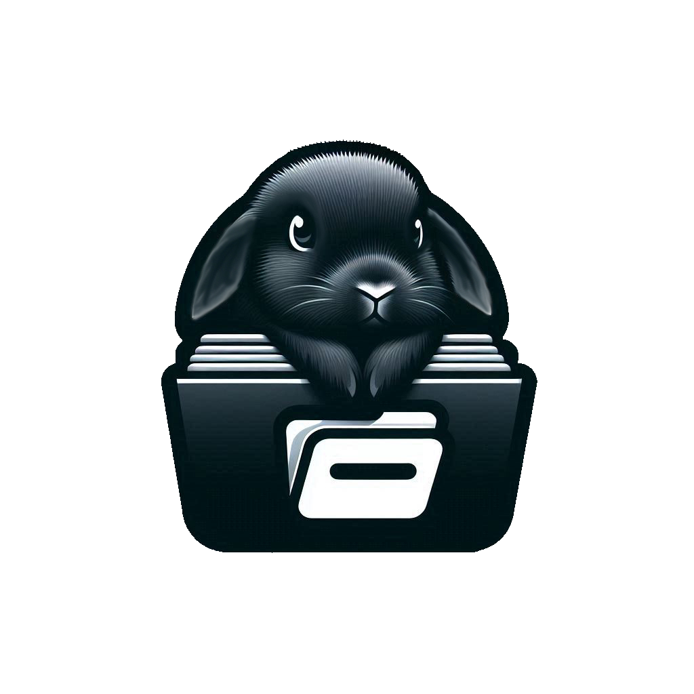

<h3>This is a Web App</h3>

El <b>MVP</b> (Minimum Viable Product) de esta aplicación será lo siguiente:
<ul>
    <li>Crear usuarios y permitir el acceso a su aplicación mediante la consulta de su base de datos</li>
    <li>La capacidad de crear ficheros dentro de la aplicación, con su usuario respectivo cada fichero</li>
    <li>Poder escribir en los ficheros y poder guardar estos</li>
    <li>Tener herramientas de formato de texto</li>
    <li>Poder introducir contenido multimedia</li>
    <li>Capacidad de compartir el archivo con otros usuarios a través del link y ciertos accesos permitidos por el dueño</li>
    <li>Capacidad de exportar el archivo a formatos convencionales muy usados</li>
</ul>
 

 
